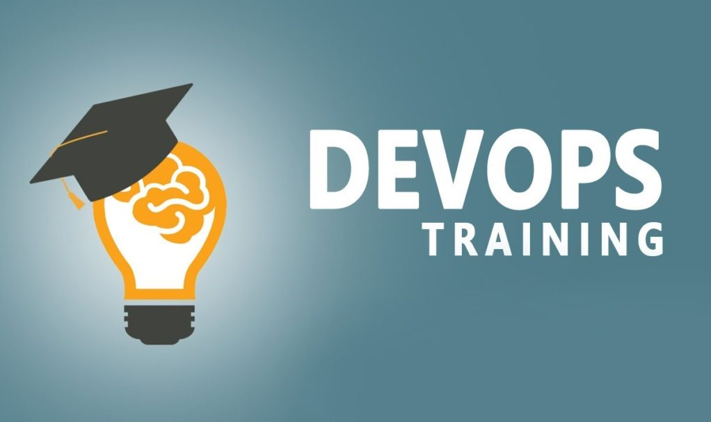

# DevOps Training
---

## Welcome
This repository holds a bunch of "worksheets" that are aimed to help you acquire the required skills you must have in order to work with the various tools you will come across and work with during your DevOps work.

So each "topic" has its own worksheet, that will help you get the knowledge and skills you need to have in this topic. 
Most of the topics also include a corresponding git repository of the form `Training<topic>` for example `TrainingArtifactory`. Those git repositories contain some auxiliary files that you will use during the exercises.

## Worksheets and how to use them
The worksheets are comprised of:
- Reference to reading material / YouTube videos. Use these as the basis for your knowledge.
- Commands: those are commands you need to know when working with the tool.
- Keywords: key concepts regarding the topic. Make sure you have a firm understanding of those concepts
- Questions: some questions to help you focus on what you need to know. use them as basis for guided reading through the materials. If yo don't know the answer for a question - don't be stuck, go through the exercises and things will become clearer.
- Exercises: the most important part - make sure you do them completely and understand what you do !

